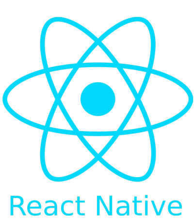
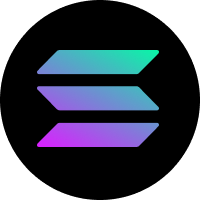
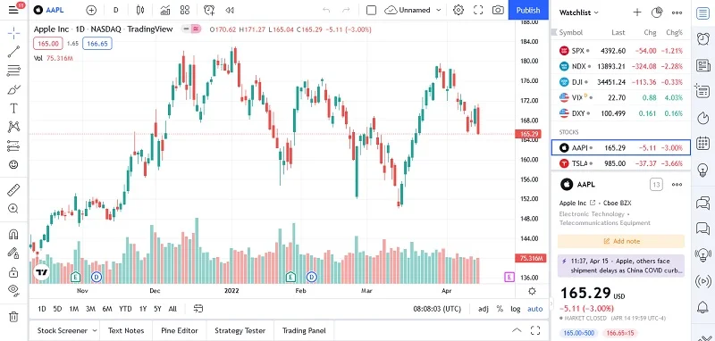

<!DOCTYPE html>
<html lang="fa" dir="rtl">
<head>
    <meta charset="UTF-8">
    <meta name="viewport" content="width=device-width, initial-scale=1.0">
    <title>رزومه یاسر پناهی | برنامه‌نویس و تریدر</title>
    <link rel="stylesheet" href="bio.css">
    <link rel="stylesheet" href="https://cdnjs.cloudflare.com/ajax/libs/font-awesome/6.4.0/css/all.min.css">
</head>
<body>
    

        <header>
            

                

                    
                

                

                    <h1>یاسر پناهی</h1>
                    
تریدر و برنامه نویس 

                    

                        <i class="fas fa-envelope"></i> yaserpenahi@gmail.com
                        <i class="fas fa-phone"></i> +989055955949
                    

                

            

            

                <a href="https://www.instagram.com/yaserpanahi.1383?igsh=dnEyaXlkd2xlOWFh" class="social-icon" id="instagram"><i class="fab fa-instagram"></i></a>
                <a href="https://github.com/yaser0405" class="social-icon" id="github"><i class="fab fa-github"></i></a>
                <a href="#" class="social-icon" id="linkedin"><i class="fab fa-linkedin"></i></a>
                <a href="https://t.me/YA3R19" class="social-icon" id="telegram"><i class="fab fa-telegram"></i></a>
            

            

        </header>
        
        <section id="about">
            <h2><i class="fas fa-user"></i> درباره من</h2>
            

                با بیش از چندین سال تجربه در حوزه‌های برنامه‌نویسی و ترید در بازارهای مالی، من توانسته‌ام مهارت‌های خود را در هر دو زمینه به سطح حرفه‌ای برسازم. تخصص من در تلفیق دانش برنامه‌نویسی با استراتژی‌های معاملاتی، به من امکان داده راهکارهای نوآورانه برای تحلیل بازار و اتوماسیون معاملات ارائه دهم.
                من همواره در حال یادگیری و به‌روزرسانی دانش خود در هر دو حوزه هستم و از چالش‌های جدید استقبال می‌کنم. هدف من ایجاد راه‌حل‌های هوشمند برای بهینه‌سازی استراتژی‌های معاملاتی با استفاده از تکنولوژی‌های نوین است.
            

        </section>
        
        <section id="skills">
            <h2><i class="fas fa-code"></i> مهارت‌ها</h2>
            

                

                    <h3>برنامه‌نویسی</h3>
                    

                        
                        
                        
                        
                        
                    

                

                
                

                    <h3>ارزهای دیجیتال</h3>
                    

                        
                        
                        
                        
                    

                

            

        </section>
        
        <section id="experience">
            <h2><i class="fas fa-briefcase"></i> سوابق کاری</h2>
            

                

                    <h3>تریدر و توسعه‌دهنده مستقل</h3>
                    1400 - اکنون
                

                <ul>
                    <li>توسعه و پیاده‌سازی استراتژی‌های معاملات الگوریتمی</li>
                    <li>ایجاد ابزارهای تحلیل برای بازارهای مالی</li>
                    <li>مشاوره به سرمایه‌گذاران در زمینه اتوماسیون معاملات</li>
                </ul>
            

            
            

                

                    <h3>توسعه‌دهنده نرم‌افزار ارشد - شرکت فناوری مالی تک‌تریدر</h3>
                    1402-1403
                

                <ul>
                    <li>طراحی و توسعه سیستم‌های معاملات پیشرفته</li>
                    <li>پیاده‌سازی الگوریتم‌های هوش مصنوعی برای پیش‌بینی روند بازار</li>
                    <li>بهینه‌سازی زیرساخت‌های نرم‌افزاری</li>
                </ul>
            

        </section>
        
        <section id="projects">
            <h2><i class="fas fa-project-diagram"></i> پروژه های برجسته</h2>
            
            

                <h3>ربات تحلیلگر اخبار مالی</h3>
                
طراحی یک سیستم هوشمند برای جمع آوری و تحلیل اخبار مالی و تأثیر آن ها بر بازارها با استفاده از تکنیک های پردازش زبان طبیعی.

                

                    Web Scraping
                    NLP
                    Python
                

            

            
            

                <h3>اپلیکیشن تحلیل بازار</h3>
                
توسعه اپلیکیشن موبایل برای تحلیل لحظه ای بازارهای مالی با قابلیت ارسال هشدارهای قیمتی و نمایش نمودارهای تکنیکال پیشرفته.

                

                    
                

                

                    MongoDB
                    Node.js
                    React Native
                

            

        </section>
        
        <section id="contact">
            <h2><i class="fas fa-envelope"></i> آماده همکاری با شما هستم</h2>
            

                اگر به دنبال راهکارهای نوآورانه در زمینه برنامه‌نویسی یا ترید هستید، یا نیاز به مشاوره تخصصی دارید، خوشحال می‌شوم با من در تماس باشید.
            

            
            

                <h3>تماس مستقیم</h3>
                

                    <i class="fas fa-envelope"></i>
                    <a href="mailto:yaserpenahi@gmail.com">yaserpenahi@gmail.com</a>
                

                

                    <i class="fas fa-phone"></i>
                    <a href="tel:+989055955949">+989055955949</a>
                

            

        </section>
        
        <footer>
            
یاسر پناهی - تمامی حقوق محفوظ است. © 1404-3-1

        </footer>
    

</body>
</html>
